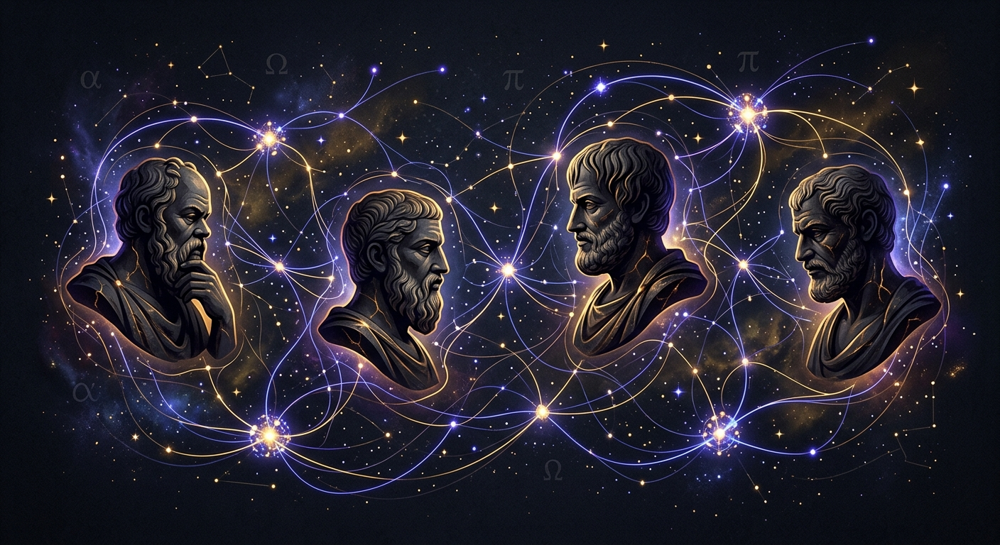

# 🏛️ Philo-Graph: Interaktivna Mreža Filozofskih Utjecaja

Dobrodošli u **Philo-Graph**, inovativnu, visoko-estetsku web aplikaciju dizajniranu za vizualizaciju i analizu povijesti filozofije te međusobnih utjecaja vodećih mislioca kroz epohe. Spajanjem modernih tehnologija grafičkog sučelja i snage **Gemini AI (3.5 Flash)** modela, Philo-Graph pruža intuitivan, edukativan i znanstveno utemeljen uvid u evoluciju ideja.



---

## 🎨 Temeljna Zamisao i Filozofija

Povijest filozofije nije puki popis izoliranih mislioca, već kontinuirani, dinamični dijalog. Svaki filozof nadograđuje ili žestoko osporava ideje svojih prethodnika (vidi npr. Lockeov odgovor na Descartesove urođene ideje ili Hegelovu dijalektičku nadogradnju Kanta). 

Philo-Graph strukturira taj kompleksni dijalog u **četiri ključne vremenske epohe** koje su vizualno kodirane suptilnim, prepoznatljivim spektrima boja:
*   🟢 **Antika** (Sokrat, Platon, Aristotel, Epikur) — *smaragdni tonovi*
*   🟡 **Srednji vijek i Renesansa** (Augustin, Toma Akvinski, Machiavelli, Montaigne) — *jantarni tonovi*
*   🔵 **Moderno doba** (Descartes, Spinoza, Locke, Kant, Hegel, Nietzsche) — *indigo tonovi*
*   🔴 **Suvremeno doba** (Husserl, Wittgenstein, Heidegger, Sartre, Foucault) — *ružičasti tonovi*

---

## 🚀 Ključne Funkcionalnosti Aplikacije

1.  **Interaktivni Grafikon s "Physics" Rasporedom:** 
    *   Sustav omogućuje promjenu rasporeda (razvrstavanje po epohama ili kružni raspored).
    *   Modularan i prilagodljiv s punom podrškom za **slobodno povlačenje (Drag & Drop)** čvorova na platnu radi lakšeg grupiranja i proučavanja.
2.  **Filtriranje i Dinamička Pretraga:**
    *   Jednim klikom možete uključiti ili isključiti cijele epohe za fokusiranu analizu određenog povijesnog razdoblja.
    *   Prediktivna pretraga pretražuje imena filozofa, izvorne nazive, te njihove najvažnije koncepte (npr. *ataraksija, cogito, tabula rasa*).
3.  **Integrirani Gemini AI Analitičar (na hrvatskom jeziku):**
    *   Klikom na bilo kojeg filozofa saznajete njegove osnovne podatke i ključne ideje.
    *   Klikom na gumb **"Zatraži Gemini AI Analizu"**, server pokreće analizu pomoću službenog `@google/genai` API-ja i generira duboki akademski rad o povijesnom kontekstu, glavnim idejama i trajnom utjecaju.
    *   Klikom na bilo koju **usmjerenu strelicu utjecaja** (npr. *Nietzsche -> Foucault*), Gemini generira komparativnu analizu koja secira zajedničke filozofske probleme, rekonceptualizaciju ideja te povezane citate.
4.  **Generiranje i Preuzimanje Python Pyvis Alata:**
    *   Za potrebe prezentacija, znanstvenih radova ili izvanmrežnog istraživanja, ugrađen je gumb za preuzimanje punog Python izvornog koda (`filozofija_mreza.py`).
    *   Skripta u Pythonu koristi knjižnicu `pyvis` te službeni Google GenAI klijent za renderiranje samostalne, interaktivne web mreže u pregledniku sa sučeljem na hrvatskom jeziku.

---

## 🛠️ Tehnološki Stog (Architecture)

*   **Front-end:** React 19 + TypeScript + Vite (koristeći modernu `motion` knjižnicu za mikro-animacije i tranzicije).
*   **Stilski Okvir:** Tailwind CSS s temom **"Elegant Dark"** — prilagođeno tamno sučelje, visoki kontrast, prostranost i estetski suptilna kozmička mreža točaka.
*   **Back-end (Server):** Express.js na portu `3000` koji djeluje kao sigurni proxy. Osigurava da se vaš povjerljivi `GEMINI_API_KEY` nikada ne izloži pregledniku (klijentu).
*   **AI Integracija:** Službena `@google/genai` knjižnica, s modelom `gemini-3.5-flash` podešenim na visoku stručnost i preciznost na hrvatskom jeziku.

---

## 🚀 Kako Pokrenuti Aplikaciju Lokalno

### 1. Pokretanje Web Aplikacije (React + Express)
Za pokretanje punog full-stack sučelja:

```bash
# Instalirajte zavisnosti
npm install

# Postavite svoj API ključ u .env datoteci (kopirajte .env.example)
# GEMINI_API_KEY="vaš-api-ključ"

# Pokrenite razvojni poslužitelj ( Express poslužuje i klijent i API )
npm run dev
```

### 2. Izvanmrežno Pokretanje Preuzete Python Skripte
Ukoliko ste preuzeli generirani `filozofija_mreza.py` iz sučelja, pokrenite ga u tri jednostavna koraka:

```bash
# 1. Instalirajte potrebne biblioteke
pip install google-genai pyvis networkx

# 2. Postavite API ključ
export GEMINI_API_KEY="vaš_api_ključ"   # Na Linux / macOS
set GEMINI_API_KEY="vaš_api_ključ"      # Na Windows Command Prompt

# 3. Pokrenite skriptu
python filozofija_mreza.py
```
Skripta će vas pitati želite li pokrenuti tekstualni dijalog i preglede s AI klijentom, a zatim će generirati prekrasnu interaktivnu `povijest_filozofije_utjecaji.html` datoteku i otvoriti je u vašem pregledniku.

---

## 🔮 Budući Razvoj (Further Developments)

U planu su sljedeće nadogradnje koje će podići Philo-Graph na razinu profesionalne digitalne humanističke platforme:

1.  **Vremenska Lenta s Animacijom (Time-Travel Mode):**
    *   Dodavanje interaktivnog klizača (slidera) koji rekonstruira nastanak utjecaja kronološkim redoslijedom od 6. st. pr. Kr. do danas.
2.  **Sustav Semantičkog Grupiranja (Semantic Concept Map):**
    *   Korištenje tekstualnih embeddinga za automatsko prostorno povezivanje filozofa s obzirom na podudarne koncepte iz njihovih djela (npr. grupacije *racionalista*, *empirista*, *egzistencijalista*).
3.  **RAG Baza Cijelih Tekstova (Retrieval Augmented Generation):**
    *   Omogućavanje izravnog pretraživanja izvornih citata (npr. iz Platonove *Države* ili Kantove *Kritike čistog uma*) unutar same analize.
4.  **Korisničke Bilješke i Izvoz Mreža:**
    *   Omogućavanje korisnicima da sami komentiraju i dodaju nove veze te izvoze svoje prilagođene grafove u JSON ili PNG format.

---

*Razvijeno s pažnjom u Google AI Studio Build okruženju, 2026.*
