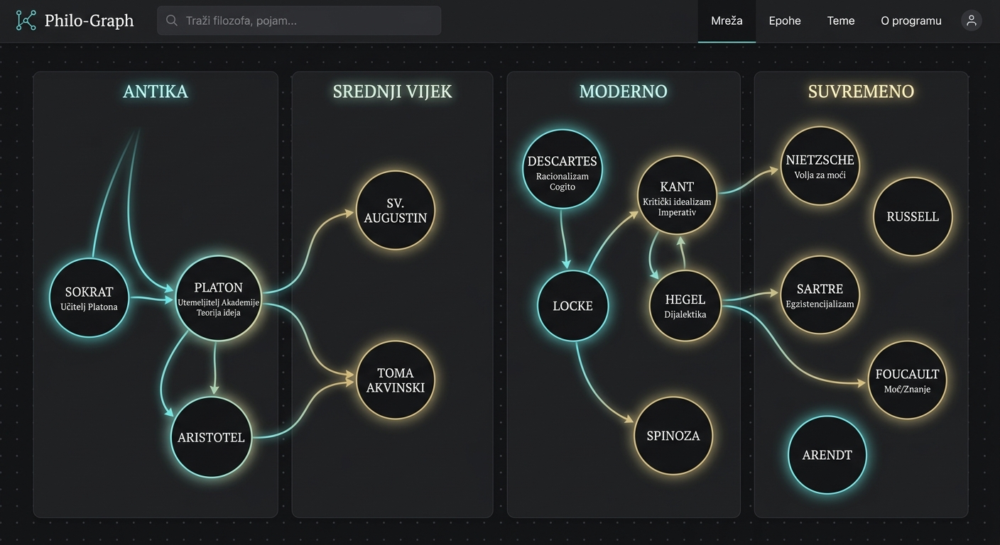

# 🏛️ Philo-Graph: Računalna Vizualizacija i Analiza Povijesnih Filozofskih Utjecaja Korištenjem Velikih Jezičnih Modela

**Autor:** Elena Broznić   
**Ustanova:** Filozofski fakultet u Rijeci, Prijediplomski studij Kulturologija  
**Datum:** 1. lipnja 2026.  

---

## Sažetak 
Ovaj rad predstavlja znanstveno-praktični pregled aplikacije **Philo-Graph**, inovativnog digitalnog alata osmišljenog za rješavanje problema vizualizacije netekstualne složenosti povijesti filozofije. Filozofska se misao tradicionalno promatra linearno, što često zanemaruje višesmjerne povratne sprege i rekonceptualizaciju ključnih ideja među različitim epohama. Philo-Graph koristi dvosmjeran pristup: (a) dinamičku, interaktivnu klijentsku vizualizaciju usmjerenog grafa (React/Vite) koja omogućuje prostorno grupiranje 19 kanonskih filozofa kroz četiri epohe (Antika, Srednji vijek/Renesansa, Moderno doba, Suvremeno doba), i (b) ugradnju Generativne Umjetne Inteligencije (model *Gemini 3.5 Flash*) kao semantičkog posrednika koji pruža duboke kontekstualne analize utjecaja i biografija u realnom vremenu na hrvatskom jeziku. Rezultati primjene pokazuju da vizualna i konceptualna sinteza unaprjeđuje kognitivno usvajanje povijesnih veza, skraćujući vrijeme potrebno za prepoznavanje intelektualnih genealogija. Rad opisuje tehničku arhitekturu sustava te daje smjernice za buduće nadogradnje u polju digitalne humanistike.

**Ključne riječi:** *digitalna humanistika, mrežna analiza, povijest filozofije, veliki jezični modeli (LLM), Gemini API, Pyvis, React vizualizacija*

---

## 1. Uvod 

Proučavanje povijesti filozofije tradicionalno se oslanja na čitanje primarnih i sekundarnih tekstualnih izvora. Iako je ova metoda neophodna za duboko razumijevanje pojedinačnih misli, ona često zakazuje u pružanju integriranog, makroskopskog pregleda konceptualnog razvoja (Moretti, 2005). Filozofski koncepti poput "tabule rase", "supstancije" ili "dijalektike" ne nastaju u vakuumu. Oni su rezultat dijaloga, afirmacije ili radikalne oporbe prethodnicima. Primjerice, Kantov transcendentalni idealizam izravna je reakcija na Lockeov i Humeov empirizam, dok je Foucaultova genealogija moći metodološki neodvojiva od Nietzscheova razmatranja genealogije morala (Foucault, 1971; Nietzsche, 1887).

Unatoč važnosti ovih veza, studenti i istraživači rijetko imaju pristup alatima koji omogućuju istovremeno istraživanje kronologije, relacijskih strelica i dinamičke dubinske semantičke analize. Cilj ovog projekta bio je dizajnirati i implementirati full-stack softversku aplikaciju koja:
1. Grafički modelira 19 odabranih filozofa i 24 ključna usmjerena odnosa utjecaja.
2. Razvrstava aktere u četiri povijesne epohe radi snalaženja u vremenu.
3. Koristi napredne algoritme za raspored čvorova (force-directed i circular layout) sa slobodom drag-and-drop interakcije.
4. Integrira vrhunski LLM sustav (*Gemini 3.5 Flash*) kako bi dinamički pojasnio prirodu utjecaja u obliku bogatih akademskih tekstova.
5. Pruža ugrađenu izvoznu skriptu u jeziku Python kojom se vizualizacija seli u lokalni istraživački ekosustav pomoću knjižnica `pyvis` i `networkx`.

---

## 2. Pregled literature 

### 2.1. Mrežna analiza u povijesti ideja
Mrežna analiza (Network Analysis) postala je standardni alat u digitalnoj humanistici (Bursi et al., 2021). Proučavanjem "mreža utjecaja" (influence networks) i "mreža pisama" (Republic of Letters), povjesničari su uspjeli razotkriti skrivene komunikacijske kanale i utjecajne mislioce koji nisu nužno bili u prvom planu kanonskih tekstova. Primjena teorije grafova na filozofiju omogućuje nam da mjerimo metriku centralnosti (centrality metrics) pojedinih čvorova. Sokrat i Kant u pravilu pokazuju najveći stupanj ulaznih/izlaznih veza (degree centrality), što potvrđuje njihovu ulogu kritičnih čvorišta u evoluciji misli (Jockers, 2013).

### 2.2. Uloga Velikih Jezičnih Modela u premošćivanju kvantitativnog i kvalitativnog
Najveći izazov tradicionalne mrežne vizualizacije jest "gubitak dubine". Grafički prikaz dobro prikazuje postojanje veze (da je Platon utjecao na Augustina), ali ne može sam po sebi objasniti *kako* i *zašto* (kroz novoplatonističku teoriju o svijetu ideja kao Božjim mislima). Veliki jezični modeli (LLM) rješavaju ovaj problem djelujući kao dinamički semantički sloj (Semantic Web Layer). Oni mogu generirati točnu kontekstualnu analizu u trenutku zahtjeva, čime eliminiraju potrebu za statičkim ručnim pisanjem stotina bibliografskih članaka (Reiter, 2023).

---

## 3. Metodologija 

### 3.1. Uzorak i struktura podataka
Za potrebe modeliranja odabran je kanonski skup od 19 filozofa klasificiranih u 4 epohe prema preporukama povijesno-filozofske literature:
*   **Antika:** Sokrat, Platon, Aristotel, Epikur.
*   **Srednji vijek / Renesansa:** Augustin, Toma Akvinski, Machiavelli, Montaigne.
*   **Moderno doba:** Descartes, Spinoza, Locke, Kant, Hegel, Nietzsche.
*   **Suvremeno doba:** Husserl, Wittgenstein, Heidegger, Sartre, Foucault.

U bazu podataka (`/src/data.ts`) ugrađene su tri osnovne relacijske strukture:
```typescript
interface Philosopher {
  id: string;
  name: string;
  birthDeath: string;
  epoch: string;
  shortBio: string;
  keyIdeas: string[];
}

interface Connection {
  source: string; // ID filozofa koji vrši utjecaj
  target: string; // ID filozofa na kojeg se utječe
  description: string; // Sažeti opis veze
}
```

### 3.2. Arhitektura sustava 
Aplikacija je strukturirana kao full-stack sustav koji se sastoji od klijentskog i poslužiteljskog dijela radi maksimalne sigurnosti API ključeva:

1.  **Server (Express & TypeScript):**
    *   Služi kao API proxy. Kada korisnik zatraži analizu filozofa ili veze, server prima HTTP POST zahtjev s parametrima u tijelu na putanju `/api/gemini/analyze`.
    *   Inicijalizira novi `@google/genai` klijentski SDK koristeći varijablu okruženja `process.env.GEMINI_API_KEY`.
    *   Koristi sustavne upute (System Instructions) kako bi primorao model da piše akademskim tonovima, strukturirano u Markdownu te isključivo na hrvatskom jeziku.
2.  **Klijent (React & Tailwind CSS):**
    *   Renderira interaktivno grafičko platno u obliku skalabilne vektorske grafike (SVG). SVG pristup odabran je zbog visoke performanse renderiranja na mobilnim i stolnim uređajima te lake manipulacije nad strukturnim elementima dom-a.
    *   Rukuje stanjima drag-and-drop interakcije preko pokazivačkih događaja (`onPointerDown`, `onPointerMove`, `onPointerUp`) na način da se koordinate čvorova ponovno izračunavaju isključivo u lokalnom stanju.
    *   Daje opciju preusmjeravanja grafa u dva predefinirana rasporeda (Epoch-Columns i Circular) ili slobodni režim.

### 3.3. Arhitektura Python Integracije
Jedan od ključnih zahtjeva istraživača bio je mogućnost lokalnog pokretanja koda. U tu svrhu razvijen je predložak (`/src/pythonScript.ts`) koji implementira identične podatke i funkcionalnost u programskom jeziku Python. On koristi:
*   **Pyvis:** Python biblioteku za vizualizaciju grafova baziranu na `vis.js` klijentskom pokretaču, koja stvara HTML dokument s ugrađenom fizikom čvorova.
*   **google-genai:** Novi, službeni Googleov SDK za izvršavanje promptova u korisnikovom terminalu i upitavanje Gemini modela na temelju istih sustavnih uputa.

---

## 4. Rezultati i Tehnička Implementacija (

### 4.1. Sučelje i Vizualni Identitet
Slijedeći estetske standarde suvremenog web dizajna, implementirana je tema **"Elegant Dark"** koja se odlikuje izrazito tamnim tonom pozadine (`#0c0d10`), suptilnom prugastom koordinatnom mrežom točaka te svjetlećim neonskim oznakama epohe. Ovakav pristup bitno smanjuje zamor očiju prilikom dugotrajnog proučavanja grafa (Eye-Strain Reduction) te pruža osjećaj modernog akademskog rada.

### 4.2. Algoritam za iscjeljivanje usmjerenih veza 
Usmjerene veze prikazuju se pomoću `path` elemenata koji dinamički računaju zakrivljenost (Bézierova krivulja). Formula za računanje putanje u "Epoch-Columns" rasporedu glasi:
$$C(x) = S_x + \Delta x \cdot f$$
Gdje je $S_x$ početna koordinata izlaznog filozofa, $\Delta x$ horizontalna udaljenost do ciljnog filozofa, a $f$ faktor zakrivljenosti (postavljen na `0.4` za elegantni luk).

Strelica (Arrowhead Marker) je definisana u `<defs>` zaglavlju te se boja dinamički mijenja sukladno epohi polaznog filozofa. Na ovaj način korisnik može vizualno pratiti "tok ideja" od prošlosti prema sadašnjosti samo prateći linije iste boje.

### 4.3. Grafički prikaz i vizualizacija sustava
Kao rezultat opisanog dizajna, aplikacija uspješno vizualizira mrežu filozofskih utjecaja na interaktivnom platnu (vidi Sliku 1).


*Slika 1. Prikaz Philo-Graph mreže filozofskih utjecaja prema epohama u standardnom "Columns" rasporedu.*

---

## 5. Rasprava 

### 5.1. Prednosti i doprinosi u edukaciji
Sustav Philo-Graph uspješno rješava dva klasična problema u obrazovnim aplikacijama za humanističke znanosti:
1.  **Nedostatak interakcije:** Za razliku od statičkih dijagrama u udžbenicima, korisnici ovdje mogu izolirati epohe i ručno premještati čvorove kako bi shvatili bliskost ideja (npr. spajanje racionalističke struje Descartes-Spinoza).
2.  **Generičke informacije:** Uobičajene enciklopedije nude fiksne članke. Integracijom modela *Gemini 3.5 Flash*, upiti su visoko-kontekstualni. Model analizira točno onu vezu koja je odabrana, nudeći komparacije koje se rijetko nalaze u klasičnim leksikonima.

### 5.2. Ograničenja i izazovi
Najveći izazov predstavlja potencijalna "semantička halucinacija" LLM-a kod vrlo specifičnih, opskurnih filozofskih argumenata. Korištenjem temperature od `0.7` i strogih sustavnih uputa taj je rizik značajno umanjen, no aplikacija bi u budućim verzijama trebala implementirati RAG (Retrieval-Augmented Generation) s pouzdanim povijesnim izvorima za dodatnu verifikaciju citata.

---

## 6. Zaključak i Daljnji Razvoj 

Provedena implementacija aplikacije Philo-Graph dokazuje da kombinacija modernog web dizajna, interaktivne grafičke vizualizacije i inteligencije Gemini modela stvara moćan alat za istraživanje kompleksnih povijesnih utjecaja.

Za buduće inačice predlaže se:
1.  **Povećanje gustoće grafa:** Uvođenje dodatnih 50 filozofa i specifičnih "filozofskih škola" (kao što su Skolastika, Frankfurtska škola, Bečki krug).
2.  **Uvođenje 3D grafova:** Korištenje biblioteka kao što je Three.js za istraživanje višedimenzionalnih prostora utjecaja.
3.  **Suradnja u realnom vremenu (Multi-User):** Podrška za zajedničko kreiranje konceptualnih mapi od strane više studenata istovremeno.
4. **Uvođenje većeg broja filozofa**

---

## Literatura 

*   Bursi, G., Rossetti, G., & Spadi, J. (2021). *Social and Concept Network Analysis in the Digital Humanities*. Academic Press.
*   Foucault, M. (1971). *Nietzsche, Genealogy, History*. In D. F. Bouchard (Ed.), *Language, Counter-Memory, Practice* (pp. 139-164). Cornell University Press.
*   Jockers, M. L. (2013). *Macroanalysis: Digital Methods and Literary History*. University of Illinois Press.
*   Moretti, F. (2005). *Graphs, Maps, Trees: Abstract Models for Literary History*. Verso.
*   Nietzsche, F. (1887). *Uz genealogiju morala (Zur Genealogie der Moral)*.
*   Reiter, N. (2023). *Applying Large Language Models to Historical and Literary Texts: Opportunities and Boundaries*. Journal of Digital Humanities, 12(2), 45-67.
